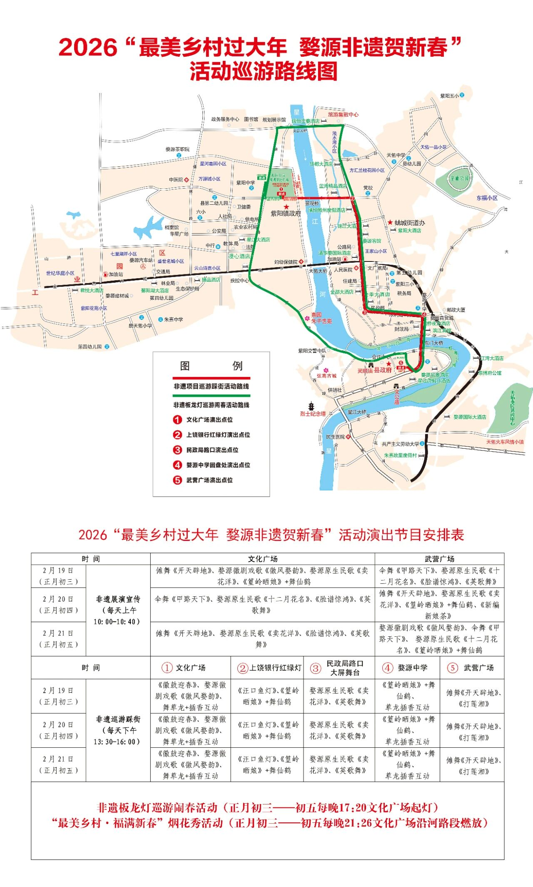

# 江西之旅

## 一、路线规划

- Day1: 南昌（晚上8点烟火）
- Day2：南昌一日游
- Day3：南昌 -> 景德镇一日游
- Day4：景德镇 -> 婺源一日游 -> 三清山索道附近住宿
- Day5：三清山一日游 -> 上饶市区住宿
- Day6：上饶 -> 宜春明月山温泉
- Day7：宜春 -> 返程

## 二、计划内容

### Day1 南昌住宿 —— 秋水广场看晚8点跨年烟火 —— 住宿附近吃饭 —— 万寿宫（够时间就去）

- 跨年烟火

年初一晚上8:00的跨年烟火，观看地点有`红谷中大道的江风水韵`和`秋水广场`和`滕王阁`

> tips：初一的烟花下午5点车就进不去了，要步行哦（散场也会堵车，所以建议车停相隔几站的地铁，坐地铁到秋水广场，腿着去，怕累带个小板凳），江边广场人特别多，千万注意安全，江西正月很冷注意保暖，南昌初一晚上的饭挺难找的，好吃的店基本都预约满了，如果要吃的话要提前找。

### Day2 绳金塔赶集（有就去，早餐随意）——  江西省博物馆 —— 八一广场 —— 午餐（羊子巷 和 万寿宫）—— 南昌之星摩天轮

- 江西省博物馆

放票时间：正常情况下，每晚8点放出7天的门票，提前在`江西省博物馆`公众号预约，我们是18 号去，因此在12号晚上抢票

- 八一广场

在八一广场拍到网上很火的与美术馆合照（美术馆就不建议去看，里面的东西非常一般）

- 羊子巷

羊子巷很多当地美食，记得吃拌粉瓦罐汤哦

- 万寿宫

绿豆饼都是一样的，不用去跟风排人多的，小邓臭豆腐，变态辣烤翅，糊羹，切糕，粽子，章记夫妻煎饼都可以值得打卡

- 南昌摩天轮

国内最高的摩天轮，如果感兴趣可以上去试一试，50一人

- 洪都大拇指
- 鲲茶

南昌连锁奶茶店，建议试试

### Day3 南昌 —— 景德镇 —— 浮梁古县衙 —— 陶阳新村 —— 陶溪川夜市

- 浮梁古县衙

五品县令的县衙，每天有4场升堂表演（10:00，11:00，14:00，15:30）

- 陶阳新村

厂货最多，性价比最高

- 陶溪川夜市

代表景德镇水平最高的地方，但是善用淘宝识图。

> 大实话攻略请参考：https://www.bilibili.com/video/BV1SV1YBQE3q/?spm_id_from=333.337.search-card.all.click&vd_source=5386948fe290e4b93240399f07738251

### Day4 景德镇 —— 婺源 —— 文公商城早市（看去的早不早） —— 武营广场新年展演 —— 午饭（婺江食府）—— 婺女洲 —— 三清山索道附近住宿

- 武营广场新年展演 （10:00 - 10:40）

看完后看看要不要去隔壁的弦高古城逛逛

- 婺女洲

某鱼购买门票，105左右

### Day5 三清山东部索道 —— 小环线 or 中环线 —— 东部索道回程 —— 上饶市

- 三清山

  - 小环线

  金沙索道 —— 巨蟒栈道 —— 神驼峰 —— 巨蟒出山 —— 东方女神 —— 女神栈道 —— 金沙索道下山

  - 中环线

  金沙索道 —— 巨蟒栈道 —— 神陀峰 —— 巨蟒出山 —— 东方女神 —— 杜鹃谷 —— 玉台 —— 玉女开怀 —— 连升三级 —— 一线天 —— 神龙戏松 —— 东南栈道 —— 金沙索道下山

  - 大环线

  爬不了，别搞

> 冬季爬山物品准备清单：
>
> - 冰爪
> - 手套
> - 登山杖
> - 冲锋衣 or 羽绒服

### Day6 上饶 —— 早餐（帝景米粉 and 茅缘灯盏粿） —— 宜春明月山温泉 —— 晚餐（老陈私房菜） —— 宜春市区住宿

- 宜春明月山温泉

某鱼买150一位

## 美食图鉴

### **一、南昌**

作为江西省会，南昌菜是赣菜的代表，口味偏辣，擅长烧、炖、炒。

- **经典菜品**：
  - **藜蒿炒腊肉**：鄱阳湖的野生藜蒿清香脆嫩，搭配咸香腊肉，是南昌最具特色的时令菜。
  - **南昌煨汤（瓦罐汤）**：用土质瓦罐慢火煨制，如**鸡蛋肉饼汤、茶树菇排骨汤**，汤鲜味浓，是早餐标配。
  - **鄱阳湖胖鱼头**：以剁椒或酱椒蒸制，鱼肉鲜嫩，辣中带鲜。
  - **三杯鸡**（江西版）：用一杯米酒、一杯酱油、一杯猪油烹制，肉质酥烂，酱香浓郁。
- **小吃与街头美食**：
  - **南昌拌粉**：细米粉烫熟后加辣椒、花生、萝卜干等拌制，爽滑香辣。
  - **白糖糕**：糯米油炸后裹白糖，外酥内软，香甜不腻。
  - **麻辣藕片**：卤藕片脆辣过瘾，常见于夜宵摊。

------

### **二、景德镇**

以瓷闻名，美食融合赣皖风味，擅长烹制河鲜、山珍，口味偏咸辣。

- **经典菜品**：
  - **瓷泥煨鸡**：用瓷泥包裹土鸡煨烤，肉质酥烂，带有特殊香气。
  - **苦槠豆腐**：用野生苦槠果实制成豆腐，口感滑嫩，常烧制或凉拌。
  - **乐平狗肉**（当地传统）：冬季滋补菜，烹制讲究，肉质酥烂。
  - **碱水粑**：大米加天然碱水制成，切片与青菜、辣椒同炒，韧劲十足。
- **小吃与街头美食**：
  - **冷粉**：粗粉条拌以橘子皮、辣椒、腌菜，口感独特。
  - **饺子粑**：米粉皮包裹萝卜丝或韭菜馅，蒸熟后晶莹软糯。
  - **油条包麻糍**：油条夹着甜麻糍，咸甜酥软，早餐常见。

------

### **三、婺源**

属古徽州地区，菜系兼具赣菜与徽菜特点，注重原料本味，油重色浓。

- **经典菜品**：
  - **糊豆腐**：豆腐切碎与豆芽、香菇等煮成糊状，口感滑润，常作宴席头道菜。
  - **粉蒸菜**：如**粉蒸肉、粉蒸鱼**，用米粉包裹食材蒸制，软糯香浓。
  - **清蒸荷包红鲤鱼**：婺源特产鲤鱼，肉质细嫩，蒸制后鲜甜不腥。
  - **婺源酒糟鱼**：用米酒糟腌制鱼肉，蒸熟后酒香浓郁。
- **小吃与乡土美食**：
  - **汽糕**：米浆发酵后蒸制，表面撒虾米、豆芽，松软咸香。
  - **糯米子糕**：糯米加鸡蛋、猪肉蒸熟切片，口感扎实。
  - **灰汁果**：粳米用草木灰水浸泡后制成，可炒或煮，带独特碱香。

------

### **四、上饶**

地处赣东北，口味辣中带鲜，擅长烹制水产和山野食材。

- **经典菜品**：
  - **余干辣椒炒肉**：选用当地特产**余干枫树椒**，辣味柔和带甜，与猪肉同炒香辣下饭。
  - **弋阳鸡**：用弋阳方言称为“豆豉”的调料烧制，肉质鲜嫩。
  - **铅山烫粉**：米粉现烫，汤头用骨汤熬制，配料自选，鲜辣爽滑。
  - **鄱阳湖银鱼蒸蛋**：银鱼鲜嫩，蒸蛋滑爽。
- **小吃与街头美食**：
  - **饭麸果**：米浆制成的团子与豆芽、香菇同煮，汤鲜果Q。
  - **灯盏果**：米皮包裹萝卜丝、豆芽等蒸熟，形似灯盏。
  - **羊角糖**（糖油果子）：糯米油炸后裹糖，形似羊角。

------

### **五、宜春**

以袁州菜为代表，口味偏辣，多用腌菜、糟糠调味，乡土气息浓厚。

- **经典菜品**：
  - **宜春扎粉**：本地稻米制成的米粉，柔韧耐煮，常与肉丝、青菜爆炒。
  - **慈化鸡**：宜春慈化镇名菜，用大量辣椒、姜蒜烧制，麻辣浓香。
  - **万载三杯鸡**（与南昌略有不同）：更侧重酱香，常用万载本地酱油。
  - **樟树药膳菜**：因“药都”樟树闻名，如**药膳土鸡汤**，注重滋补。
- **小吃与街头美食**：
  - **铜鼓包圆**：红薯粉皮包裹笋、肉馅，蒸熟后透明软韧。
  - **艾米果**：艾草与糯米混合制皮，包甜咸馅料，清香软糯。
  - **宜春炒田螺**：田螺用辣椒、紫苏爆炒，夜宵人气菜品。